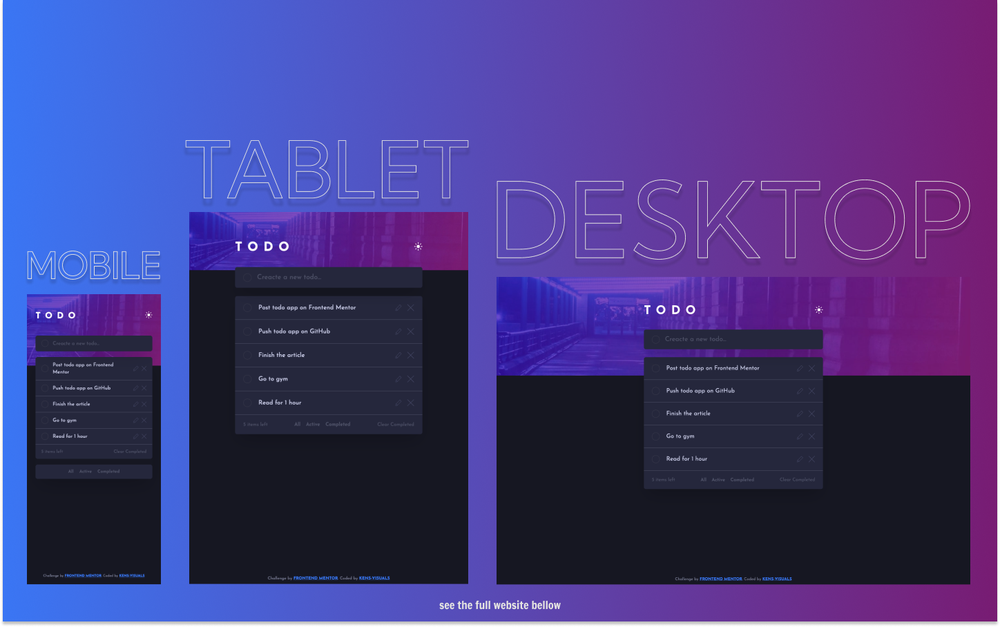

# Frontend Mentor - Todo App Solution

This is a solution to the [Todo App Challenge on Frontend Mentor](https://www.frontendmentor.io/challenges/todo-app-Su1_KokOW).

## Table of contents

- [Overview](#overview)
  - [The challenge](#the-challenge)
  - [Screenshot](#screenshot)
  - [Links](#links)
- [My process](#my-process)
  - [Built with](#built-with)
  - [What I learned](#what-i-learned)
  - [Continued development](#continued-development)
  - [Useful resources](#useful-resources)
- [Author's Links](#authors-links)

## Overview

### The challenge

Users should be able to:

- View the optimal layout for the app depending on their device's screen size
- See hover states for all interactive elements on the page
- Add new todos to the list
- Mark todos as complete
- Delete todos from the list
- Filter by all/active/complete todos
- Clear all completed todos
- Toggle light and dark mode

### Screenshot

### Links

- Live Site URL: [https://kens-visuals.github.io/todo-app/](https://kens-visuals.github.io/todo-app/)
- Solution URL: [https://www.frontendmentor.io/solutions/todo-app-built-with-react-and-tailwind-css-rJrsKyJPc](https://www.frontendmentor.io/solutions/todo-app-built-with-react-and-tailwind-css-rJrsKyJPc)

## My process

### Built with

- React
  - useState
  - useReducer
  - context
- Tailwind CSS
- Semantic HTML5 markup
- CSS Flexbox
- CSS Grid
- Mobile-first workflow

### What I learned

This project helped me to learn and practice manipulating states in React. Although, I used `useReducer` in [the last project](https://github.com/kens-visuals/calculator-app), I left like I need more practice with it. So, to-do app was a perfect opportunity to play with `useReducer` a bit more. I also used `context` for the first time, `createContext` and `useContext` hooks were pretty easy to use. I felt kind of lost in the beginning, but then got back on the track with them. Thanks to `TailwindCSS` implementing dark mode was really easy. And with the help of custom context that I made to toggle the theme, everything felt way easier than if I tried to do it with `pure CSS` or `styled-components`. So I can surely say that `TailwindCSS` is becoming one of my favorite, if not the most favorite, tool in terms of styling technologies.

### Useful resources

- [How to Use React useReducer Hook Like a Pro](https://devtrium.com/posts/how-to-use-react-usereducer-hook) - Sometimes there are some articles that are better than the official documentation, so this is one of them.

## Author's Links

- Medium - [@kens_visuals](https://medium.com/@kens_visuals)
- CodePen - [@kens-visuals](https://codepen.io/kens-visuals)
- Codewars - [@kens_visuals](https://www.codewars.com/users/kens_visuals)
- Frontend Mentor - [@kens-visuals](https://www.frontendmentor.io/profile/kens-visuals)
